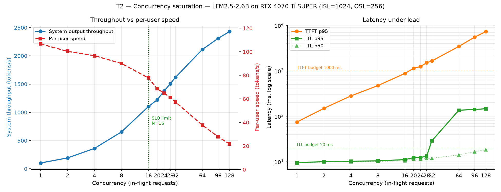
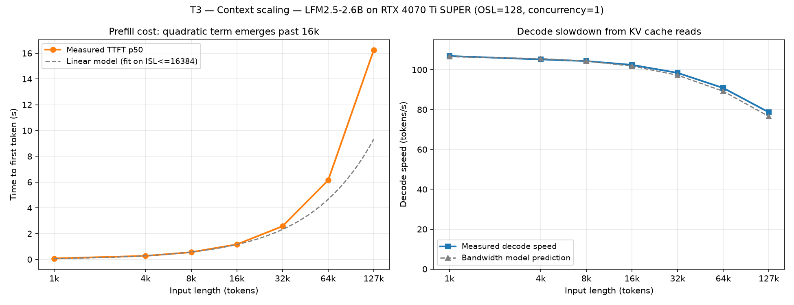

# LFM2.5-2.6B on RTX 4070 Ti SUPER

Inference benchmark of [LiquidAI/LFM2.5-2.6B](https://huggingface.co/LiquidAI/LFM2.5-2.6B)
served with vLLM on a single consumer GPU.

**Date:** 2026-08-15 · **Engine:** vLLM 0.26.0 · **Precision:** BF16 (no quantization)

Methodology and the reasoning behind every configuration choice:
[docs/METHODOLOGY.md](../docs/METHODOLOGY.md)

---

## Headline numbers

| Metric | Value |
|---|---|
| Single-stream decode speed | **107 tok/s** |
| Fraction of memory-bandwidth roofline | **86%** |
| Prefill speed (short context) | **14,700 tok/s** |
| Peak system throughput (N=128) | **2,429 tok/s** (23.4× single stream) |
| Sustainable capacity under SLO | **N=16 → 1,103 tok/s, 4.31 req/s** |
| KV cache capacity | **488,404 tokens** (7.46 GiB) |
| TTFT at 128k context | **16.2 s** |
| Decode speed at 128k context | **78.6 tok/s** (−26%) |
| Run-to-run variance (decode speed) | **0.046% CV** |

The short version: this model runs at close to the theoretical limit of the
card for single-stream generation and holds an unusually large KV cache for
its size. Aggregate throughput scales to roughly 2,400 tok/s, but per-user
latency degrades in a specific, non-obvious way well before throughput
saturates. At long context the card can hold 128k tokens comfortably — the
constraint is prefill time, not memory.

---

## 1. Setup

### Hardware

| | |
|---|---|
| GPU | NVIDIA GeForce RTX 4070 Ti SUPER, 16,376 MiB |
| Memory bandwidth | ~672 GB/s (256-bit GDDR6X) |
| Power limit | 295 W (factory OC; reference TGP is 285 W) |
| Idle VRAM used by host | ~1,068 MiB (Windows desktop + Xwayland) |
| Driver | 591.86 |

### Software

| | |
|---|---|
| OS | Windows + WSL2 → Ubuntu 26.04 LTS (kernel 6.18.33.2) |
| Python | 3.12.14 |
| vLLM | 0.26.0 |
| PyTorch | 2.11.0+cu130 |
| Triton | 3.6.0 |
| transformers | 5.15.0 |
| openai (client) | 3.1.0 |

### Server configuration

```bash
vllm serve LiquidAI/LFM2.5-2.6B \
  --host 127.0.0.1 --port 8000 \
  --dtype bfloat16 \
  --max-model-len 32768 \        # 131072 for T3
  --kv-cache-memory=6442450944 \
  --no-enable-prefix-caching \
  --seed 0
```

Two choices deserve explanation.

**Prefix caching is disabled.** It is on by default in vLLM V1. With it
enabled, repeated prompts skip prefill entirely and TTFT is measured
artificially low. Real deployments benefit from it; a latency benchmark that
leaves it on is measuring its own cache hit rate.

**KV cache is pinned in bytes, not as a percentage.**
`--gpu-memory-utilization` targets a fraction of *total* VRAM and computes KV
cache size from whatever is free at server start. Launching with a browser
open yields a different capacity than launching with it closed — capacity
drifts between runs. Pinning the byte count removes that variable.

---

## 2. Model notes

LFM2.5-2.6B is not a conventional transformer, and two properties directly
shape these results.

**Hybrid architecture.** Of its 30 layers, 22 are short convolution blocks and
only 8 are GQA attention. Since KV cache is generated solely by attention
layers, the per-token KV cost is roughly a quarter of a comparable
full-attention model — about 16 KB/token. This is why the card holds nearly
half a million tokens of context, and why the quadratic attention term in
prefill only becomes visible past 16k tokens.

**Always-on reasoning.** The model emits a reasoning trace before every
answer. The chat template appends the opening `<think>` tag to the prompt, so
only the closing `</think>` appears in the output. A short question
("What is C. elegans? Explain briefly") produced 727 tokens: roughly 500 of
reasoning and 220 of visible answer. An early test capped at 200 tokens never
reached `</think>` at all — the entire output was reasoning.

For throughput measurement this is irrelevant (output length is pinned via
`max_tokens` + `ignore_eos`). For any latency figure that models real user
experience it is not: perceived time-to-answer is far longer than TTFT,
because the user waits through the entire reasoning trace first.

---

## 3. T0 — Capacity

Memory layout at startup, measured with `--gpu-memory-utilization 0.85`:

| Component | GiB |
|---|---|
| Model weights | 5.05 |
| Peak activation | 0.50 |
| Non-torch memory | 0.07 |
| CUDA graphs | 0.33 |
| KV cache | 7.46 |
| **Total** | **13.41** |

```
GPU KV cache size: 488,404 tokens
Maximum concurrency for 32,768 tokens per request: 14.90x
```

Derived capacity, at 7.46 GiB of KV cache:

| Context per request | Concurrent requests |
|---|---|
| 1k | ~380 |
| 8k | ~60 |
| 32k | 14.9 (reported by vLLM) |
| 128k | ~3.7 |

vLLM warns `Add 2 padding layers, may waste at most 9.09% KV cache memory` —
the hybrid layer layout does not align cleanly onto the cache block structure.

Subsequent runs pin KV cache to 6 GiB (~393k tokens), which leaves ~2.7 GB of
VRAM headroom. The 0.85 setting left only ~1.3 GB free, which risks OOM if any
desktop application claims VRAM mid-run.

### Cold start

| Stage | Time |
|---|---|
| Weight loading | 2.02 s |
| Model loading (total) | 3.52 s |
| torch.compile | 9.00 s |
| CUDA graph capture | 4 s (0.33 GiB) |
| Memory profiling + dummy runs | ~50 s |
| **Engine init total** | **66.09 s** |

Measured with a cold compile cache. Most of the time is not compilation but
memory profiling.

---

## 4. T1 — Single-stream latency

120 requests across a 6 × 2 ISL/OSL grid, concurrency 1, 10 measured requests
per cell after 5 warm-up requests.

| ISL | OSL | TTFT p50 (ms) | p95 | TPOT (ms) | tok/s | ITL p99 | CV % |
|---|---|---|---|---|---|---|---|
| 128 | 128 | 18.2 | 22.5 | 9.35 | 106.9 | 9.59 | 0.12 |
| 128 | 512 | 18.2 | 24.0 | 9.36 | 106.9 | 9.64 | 0.08 |
| 512 | 128 | 41.3 | 42.2 | 9.36 | 106.8 | 9.63 | 0.03 |
| 512 | 512 | 42.0 | 42.8 | 9.36 | 106.9 | 9.68 | 0.11 |
| 1024 | 128 | 73.1 | 74.8 | 9.36 | 106.8 | 9.62 | 0.08 |
| 1024 | 512 | 73.6 | 75.5 | 9.37 | 106.7 | 9.85 | 0.15 |
| 2048 | 128 | 137.7 | 139.5 | 9.44 | 105.9 | 9.85 | 0.06 |
| 2048 | 512 | 137.6 | 139.9 | 9.44 | 105.9 | 9.78 | 0.07 |
| 4096 | 128 | 273.6 | 275.9 | 9.50 | 105.2 | 9.83 | 0.10 |
| 4096 | 512 | 273.7 | 275.7 | 9.52 | 105.0 | 9.79 | 0.08 |
| 8194 | 128 | 567.6 | 568.4 | 9.59 | 104.3 | 9.86 | 0.10 |
| 8194 | 512 | 567.8 | 569.3 | 9.61 | 104.0 | 9.91 | 0.08 |

Coefficient of variation stays below 0.15% in every cell. ITL p99 never
exceeds 10 ms — at concurrency 1 there are no stalls at all.

### Decode is bandwidth-bound

Every decoded token requires reading the full weight set from VRAM:

```
672 GB/s ÷ 5.42 GB = 124 tok/s   (theoretical ceiling)
measured: 106.9 tok/s            (86% of ceiling)
```

The remaining 14% covers sampling, scheduling and kernel launch overhead.
There is very little left on the table here.

### Prefill is linear in this range

Least-squares fit of TTFT p50 against actual prompt tokens, 128–8,194:

```
TTFT = 3.61 ms + 68.15 µs × ISL      R² = 0.9991
```

- **Intercept, 3.61 ms** — fixed overhead: localhost HTTP round trip,
  scheduler admission, first-chunk serialization. Every TTFT here includes it.
- **Slope, 1/b = 14,673 tok/s** — prefill throughput.

R² of 0.9991 means no measurable quadratic attention cost below 8k. T3 shows
where that stops being true.

**Prefill is 137× faster than decode** (14,673 vs 107 tok/s). The two phases
are bound by different resources: prefill saturates compute, decode saturates
memory bandwidth.

### Control check: OSL does not affect TTFT

At ISL 8194: 567.6 ms (OSL=128) vs 567.8 ms (OSL=512). TTFT is a function of
prefill only, as expected — an independent confirmation that the measurement
isolates the right quantity.

---

## 5. T2 — Concurrency

Sustained closed-loop load: a pool of N workers, each starting a new request
the moment its previous one completes, so exactly N requests stay in flight.
Fixed workload of ISL=1024, OSL=256.

| N | System tok/s | Per-user tok/s | Efficiency | req/s | TTFT p95 | TTFT p99 | ITL p95 | ITL p99 |
|---|---|---|---|---|---|---|---|---|
| 1 | 103.8 | 106.6 | 0.973 | 0.41 | 74 | 74 | 9.52 | 9.65 |
| 2 | 192.9 | 100.4 | 0.961 | 0.75 | 150 | 150 | 10.03 | 10.22 |
| 4 | 361.9 | 96.9 | 0.934 | 1.41 | 280 | 286 | 10.23 | 10.49 |
| 8 | 653.7 | 90.1 | 0.907 | 2.55 | 474 | 550 | 10.46 | **73.00** |
| 16 | 1102.9 | 77.8 | 0.886 | 4.31 | 877 | 1072 | 11.09 | 129.03 |
| 20 | 1220.5 | 68.7 | 0.889 | 4.77 | 1140 | 1326 | 12.29 | 130.42 |
| 24 | 1379.2 | 64.8 | 0.886 | 5.39 | 1250 | 1622 | 12.41 | 131.17 |
| 28 | 1505.2 | 61.2 | 0.879 | 5.88 | 1512 | 1895 | 13.20 | 131.73 |
| 32 | 1619.0 | 57.4 | 0.881 | 6.32 | 1651 | 2061 | 28.73 | 132.38 |
| 64 | 2113.9 | 37.7 | 0.877 | 8.26 | 3453 | 4241 | 136.05 | 140.32 |
| 96 | 2309.8 | 27.8 | 0.866 | 9.02 | 5523 | 6509 | 141.12 | 146.25 |
| 128 | 2429.3 | 21.8 | 0.872 | 9.49 | 7323 | 8874 | 147.04 | 151.60 |

*Efficiency = system throughput ÷ (N × per-user speed).*



### Throughput saturates slowly; latency does not

Aggregate throughput keeps climbing all the way to N=128, with diminishing
returns (+30% from 32→64, +9% from 64→96, +5% from 96→128). The asymptote
looks to be around 2,500–2,600 tok/s.

The interesting failure is elsewhere.

### Latency degrades bimodally, and it starts at N=8

ITL p95 looks healthy up to N=32. ITL p99 does not:

| N | ITL p50 | ITL p95 | ITL p99 |
|---|---|---|---|
| 4 | 10.2 | 10.23 | 10.49 |
| **8** | 10.4 | 10.46 | **73.00** |
| 16 | 10.50 | 11.09 | 129.03 |
| 32 | ~14 | 28.73 | 132.38 |

Pulling the raw inter-token intervals apart confirms two distinct populations:

```
N=16 : p50=10.50  p75=10.66  p90=10.89  p99=129.23  max=135.25
       2.4% of tokens took longer than 50 ms

N=64 : p50=14.09  p75=14.51  p90=125.73 p99=139.98  max=146.05
       10.5% of tokens took longer than 50 ms
```

Most tokens arrive on schedule; a minority arrive after a long pause. Crucially
**the pause size stays roughly constant** (135 ms at N=16, 146 ms at N=128)
while its *frequency* grows from 2.4% to over 10%. This is the signature of
chunked prefill: incoming requests interleave their prefill work between decode
steps, and each interruption costs about the same, so more arrivals simply mean
more interruptions.

The user-visible consequence is not "the model got slower" but "the text
streams smoothly and then freezes for a moment." An average-based benchmark
cannot see this at all.

### Efficiency stays flat — a caveat, not a result

Efficiency barely moves from N=16 (0.886) to N=128 (0.872). This says batching
itself does not become wasteful. But it is normalized against per-user speed,
which is itself collapsing (107 → 21.8 tok/s), so a flat efficiency is
compatible with severe degradation. It should not be read as "the system is
fine at N=128."

### Sustainable capacity

Choosing a service level of TTFT p95 ≤ 1,000 ms and ITL p95 ≤ 20 ms:

| N | TTFT p95 | ITL p95 | Meets SLO |
|---|---|---|---|
| 8 | 474 | 10.46 | yes |
| 16 | 877 | 11.09 | yes |
| 20 | 1140 | 12.29 | no |
| 32 | 1651 | 28.73 | no |

**N=16 → 1,103 tok/s, 4.31 req/s, per-user speed 78 tok/s.** That is 45% of
peak aggregate throughput, traded for latency that stays comfortably above
reading speed.

Note that the SLO choice dominates the answer. Against an ITL **p99** budget of
20 ms the limit drops to N=4. Interactive chat should be judged on p99 — users
notice freezes. Batch or background work can accept p95.

### Three regimes

| Regime | N | System tok/s | Per-user | Character |
|---|---|---|---|---|
| Near-free batching | 1–4 | 104–362 | 107–97 | No stalls at all |
| Practical sweet spot | 8–16 | 654–1103 | 90–78 | Occasional stalls (2.4% of tokens) |
| Saturation | 32–128 | 1619–2429 | 57–22 | 10%+ of tokens stall; TTFT in seconds |

---

## 6. T3 — Context scaling

Concurrency 1, OSL fixed at 128, ISL swept from 1k to 128k. Server restarted
with `--max-model-len 131072`; KV cache still pinned at 6 GiB.

| ISL | TTFT p50 | Prefill tok/s | TPOT (ms) | Decode tok/s | TPOT increase | CV % |
|---|---|---|---|---|---|---|
| 1,024 | 74.2 ms | 13,809 | 9.36 | 106.9 | — | 0.16 |
| 4,096 | 273.3 ms | 14,988 | 9.51 | 105.2 | 1.6% | 0.15 |
| 8,192 | 556.1 ms | 14,731 | 9.59 | 104.3 | 2.4% | 0.14 |
| 16,384 | 1.17 s | 14,057 | 9.77 | 102.4 | 4.3% | 0.12 |
| 32,768 | 2.57 s | 12,734 | 10.16 | 98.4 | 8.6% | 0.09 |
| 65,536 | 6.14 s | 10,668 | 11.01 | 90.8 | 17.7% | 0.09 |
| 130,816 | 16.23 s | 8,059 | 12.72 | 78.6 | 35.9% | 0.06 |



### Prefill: the quadratic term appears past 16k

Fitting only the short range reproduces T1's linear behaviour, but
extrapolating it fails badly:

```
ISL ≤ 16,384 :  TTFT = −12.62 ms + 71.38 µs × ISL     R² = 0.99917
                prefill speed 14,011 tok/s
                extrapolated to 130,816 → 9.32 s   (measured 16.23 s, +74%)
```

The intercept has already gone slightly negative at this cutoff — curvature is
detectable by 16k, where T1's 8k fit still gave a physically sensible +3.61 ms.

Across the full range the linear model breaks outright (R² = 0.983, intercept
−700.9 ms — physically impossible). A quadratic fits exactly:

```
TTFT = 7.89 ms + 63.06 µs/token × ISL + 0.466 ns/token² × ISL²
R² = 1.00000
```

All three terms have a physical reading. The constant is the harness and
scheduler overhead — independently measured at 3.61 ms in T1, same order of
magnitude. The linear term is the feed-forward and convolution work, which
scales with sequence length. The quadratic term is attention across the 8 GQA
layers, scaling with the square.

**At 130,816 tokens the quadratic term accounts for 49% of TTFT.** Half the
wait is attention. Prefill throughput falls from a 14,988 tok/s peak to
8,059 tok/s — a 46% drop.

### Decode: the bandwidth model holds with a constant correction

Each decoded token must read the weight set (5.42 GB) plus the accumulated KV
cache (~16 KB/token). A pure bandwidth model predicts the slowdown as the
ratio of the two:

| ISL | KV size | Predicted | Measured | Ratio |
|---|---|---|---|---|
| 4,096 | 67 MB | 1.2% | 1.6% | 1.31 |
| 8,192 | 134 MB | 2.5% | 2.4% | 0.98 |
| 16,384 | 269 MB | 5.0% | 4.3% | 0.88 |
| 32,768 | 537 MB | 9.9% | 8.6% | 0.87 |
| 65,536 | 1.07 GB | 19.8% | 17.7% | 0.89 |
| 130,816 | 2.15 GB | 39.6% | 35.9% | 0.91 |

*The 1,024 row is the reference point and is excluded. The 4,096 ratio is
noisy because both figures are near zero.*

From 16k upward the ratio sits between 0.87 and 0.91 across an eightfold
range of context. That stability is the result: the model is correct in form
and systematically ~11% pessimistic in magnitude. The likely reason is that KV
cache reads are cheaper than weight reads — the KV cache is densely packed and
accessed sequentially inside the attention kernel, where the cost can overlap
with computation, while weight reads impose a hard barrier per layer.

A corrected predictor for this hardware and model:

```
decode slowdown ≈ 0.89 × (ISL × 16 KB) / 5.42 GB
```

### Capacity is not usability

| ISL | TTFT | Practical verdict |
|---|---|---|
| ≤ 8k | < 0.6 s | Interactive |
| 16k | 1.2 s | Acceptable |
| 32k | 2.6 s | Borderline |
| 64k | 6.1 s | Batch work only |
| 128k | 16.2 s | Technically supported, not interactive |

The card holds 128k tokens with room to spare — memory is not the constraint.
Prefill time is. Note also that the measured TTFT excludes the reasoning trace:
a user asking a question over a 128k document waits 16 s for the first token
and then several more seconds of thinking before any answer appears.

### A note on stability at long context

CV falls as ISL grows (0.16% at 1k, 0.06% at 128k). Longer requests spend
proportionally more time in steady-state work and less in the noisy startup
path, so the per-request measurement gets cleaner, not worse.

---

## 7. Measurement validation

These checks are why the numbers above should be trusted.

**One chunk equals one token.** Verified by inspecting the raw SSE stream: the
opening chunk carries `role="assistant"` with empty content and no token, and a
5-token request produces exactly 5 content chunks. A 256-token request matched
the server's `completion_tokens` exactly. Without this check, ITL would be
"time per chunk," not "time per token."

**Client overhead was isolated and removed.** Early TTFT readings of ~465 ms
were almost entirely instrumentation. Decomposition:

| Source | Cost | When |
|---|---|---|
| Process start + HTTP connection setup | ~170 ms | Each new client process |
| Server cold code paths | ~430 ms | First request only |
| Actual TTFT (34-token prefill + localhost HTTP) | ~17 ms | Warm, persistent connection |

Ten sequential requests over one persistent client: 617, 17.2, 18.1, 16.5,
18.3, 17.5, 16.8, 16.2, 17.4, 17.2 ms. All measurements use a single long-lived
client. The T1 regression later refined the true fixed overhead to 3.61 ms, and
the independent T3 quadratic fit put it at 7.89 ms.

**Warm-up count is justified by data.** The first request costs 36× the second.
Five warm-up requests per configuration, none included in any statistic.

**Input length is exact.** Prompts are built from the model's own tokenizer,
accounting for the 10-token chat-template overhead, then trimmed to the target.
Requested 1024 → server reported 1024. Randomized windows into the source text
keep every prompt unique, so no request can benefit from a warm prefix.

**Token counts come from the server**, via `stream_options={"include_usage":
true}`, never from client-side tokenization.

**The client is not the bottleneck.** At N=128 a single process measured
2,429 tok/s. Running two independent processes at N=64 each, against the same
server, produced 1,220.5 + 1,249.9 = **2,470.4 tok/s** — a 1.7% difference,
within noise. Their ITL p95 values were 146.80 and 146.89 ms. The saturation is
the server's, not the harness's.

**Run-to-run variance is negligible.** T1 was repeated three times with a full
server restart between runs (GPU starting at 46 °C, 43 °C and 41 °C):

| Source of variance | CV |
|---|---|
| Within a run, request to request | 0.317% |
| Across runs, with server restart | **0.046%** |

Restarting the server produces *less* variation than the request-to-request
noise inside a single run — vLLM reallocates memory, recaptures CUDA graphs
and reselects kernels deterministically. Decode speed at ISL 8194 across the
three runs: 103.90, 103.87, 103.92 tok/s.

Two consequences. First, single-run measurements are trustworthy for this
setup, and repeated runs are only needed when the configuration changes.
Second, the 5 °C spread in starting temperature had no measurable effect —
this card is not thermally limited on this workload.

The one exception is TTFT at very short input (ISL=128), where across-run CV
reaches 2.0%. In absolute terms the spread is 0.70 ms; the relative figure is
large only because the measurement sits in the region dominated by fixed
overhead. It falls to 0.07% by ISL 8194.

**T2 repeatability.** Five concurrency levels were measured in two separate
runs at different times. Throughput spread across runs: **0.0%–0.2%**.

---

## 8. Limitations

**Closed-loop only.** A fixed number of in-flight requests is not how real
traffic arrives. Open-loop testing (Poisson arrivals at a target request rate)
would reveal queueing behaviour and the true SLO-constrained request rate.
This is the main gap in the report.

**TTFT p50 is unstable at high concurrency.** At N=96 it reads 697 ms and at
N=128, 585 ms — lower under heavier load. This is an artifact of closed-loop
measurement: requests either enter the batch immediately or queue, producing
two populations, and p50 lands wherever the measurement window falls. TTFT
p95/p99 and all ITL figures are unaffected.

**Prefix caching is off.** Real deployments would enable it and see much better
TTFT on repeated prefixes. The cache-hit benefit has not been quantified.

**The 131,072 cell could not be measured.** Input plus output must fit the
context window, so the largest usable ISL with OSL=128 is 130,944; the reported
cell uses 130,816.

**BF16 only.** No quantized variants were measured, so nothing can be said
about the accuracy/throughput trade-off on this card.

**Long-context accuracy was not tested.** T3 measures speed at 128k, not
whether the model actually uses that context well. Retrieval accuracy over long
inputs belongs to the capability phase.

**No energy measurement.** Power draw was ~225 W at full load, but
tokens-per-joule was not measured systematically.

**Single hardware sample.** One card, one driver version, one WSL2 kernel.
WSL2 cannot lock clocks (`nvidia-smi -lgc` is unavailable), so thermal
behaviour is observed rather than controlled. No throttling was observed in any
run.

---

## 9. Next

- **Open-loop test** — SLO-constrained sustainable request rate under Poisson
  arrivals
- **Prefix caching** as a separate experimental axis: cache hit vs miss TTFT
- **Quantized variants** — throughput and memory trade-off
- **Second model** for cross-model comparison on the same harness
- **Capability tests** — deferred to phase two

---

## Reproducing

```bash
# Server (T0–T2)
vllm serve LiquidAI/LFM2.5-2.6B --host 127.0.0.1 --port 8000 \
  --dtype bfloat16 --max-model-len 32768 \
  --kv-cache-memory=6442450944 --no-enable-prefix-caching --seed 0

# T1 — single-stream latency
python scripts/step3_grid.py --scenario T1 \
  --isl 128,512,1024,2048,4096,8192 --osl 128,512 \
  --n 10 --warmup 5 --cooldown 5
python scripts/analyze.py --plot

# T1 repeatability — run three times, restarting the server between each
python scripts/step3_grid.py --scenario T1rep \
  --isl 128,1024,4096,8192 --osl 256 --n 10 --warmup 5 --cooldown 5
python scripts/analyze_repeat.py --scenario T1rep

# T2 — concurrency
python scripts/step4_concurrency.py \
  --concurrency 1,2,4,8,16,32,64 --isl 1024 --osl 256 \
  --n-per-worker 5 --warmup 2 --cooldown 15
python scripts/analyze_t2.py --plot

# T3 — context scaling (restart server with --max-model-len 131072)
python scripts/step3_grid.py --scenario T3 \
  --isl 1024,4096,8192,16384,32768,65536,130816 --osl 128 \
  --n 8 --warmup 3 --cooldown 10
python scripts/analyze_t3.py --plot
```

Raw per-request data and run manifests are under `results/raw/`. Every summary
in this report can be regenerated from them.
